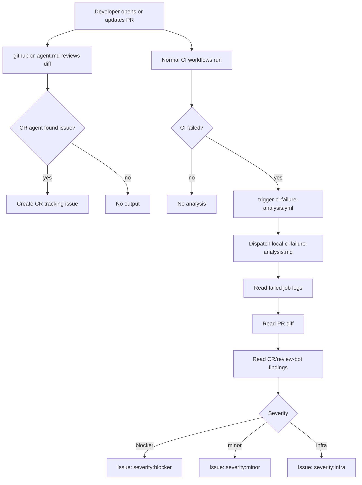

# Generic GitHub Agentic Workflows

Reusable, repository-local automation for code review and CI failure analysis.

This package is designed to be copied into **any GitHub repository in any organization**.
It does not depend on a central runtime repo, Power Platform, or `Amitro1234/vibe-coding-agents-workflow`.
That repo can host the source template, but each organization runs the workflows locally.

It uses [GitHub Agentic Workflows](https://github.blog/ai-and-ml/automate-repository-tasks-with-github-agentic-workflows/):
Markdown workflow specs are compiled into GitHub Actions lock files with `gh aw compile`.

## What It Does

- **Review Agent**: `github-cr-agent.md` reviews PR changes only. If a repository already has
  a review agent, keep it and do not install a second one.
- **CI Workflows**: existing build/test/deploy workflows remain deterministic and independent.
- **Failure Router**: `trigger-ci-failure-analysis.yml` listens for failed workflow runs using
  native `workflow_run`, normalizes context, and dispatches the analyzer.
- **Failure Analyzer**: `ci-failure-analysis.md` reads failed job logs, artifacts, PR diff, and
  optional CR-agent/review-bot comments, then classifies severity:
  `blocker`, `minor`, or `infra`.
- CI analysis results are written as GitHub issues in the same repository.

## Flow



## Installed Files

Copy these files into each target repository:

```text
.github/
  workflows/
    github-cr-agent.md
    ci-failure-analysis.md
    trigger-ci-failure-analysis.yml
```

If the target repository already has a review agent, do not copy `github-cr-agent.md`.
The analyzer treats review output as an optional input signal, not as an orchestrator.

## Generic Template Structure

```text
.github/workflows/
  github-cr-agent.md                 # optional Review Agent
  <your existing CI workflows>.yml    # CI Workflows, unchanged
  trigger-ci-failure-analysis.yml     # Failure Router
  ci-failure-analysis.md              # Failure Analyzer
```

## Repository-Specific Configuration Points

### Watched Workflow Names

Edit only the isolated configuration block in `trigger-ci-failure-analysis.yml`:

```yaml
on:
  workflow_run:
    # Repository configuration
    workflows:
      - CI
      - Build
      - Test
    types: [completed]
```

Use CI/test/build/deploy workflow names. Do not include the review-agent workflow unless
you explicitly want to analyze review-agent failures.

GitHub requires `workflow_run.workflows` to be a static list in the workflow file, so this
cannot be loaded dynamically from a runtime config file.

### Stable Analyzer Contract

The router dispatches the analyzer with this stable `workflow_dispatch` input contract:

| Input | Required | Meaning |
|---|---:|---|
| `run_id` | Yes | Failed GitHub Actions workflow run ID |
| `run_url` | Yes | URL of the failed workflow run |
| `sha` | Yes | Commit SHA associated with the failed run |
| `workflow_name` | Yes | Name of the workflow that failed |
| `conclusion` | Yes | Workflow conclusion, usually `failure` |
| `branch` | Yes | Branch associated with the run |
| `pr_number` | No | PR number if known or discoverable |
| `owner` | Yes | Repository owner |
| `repo` | Yes | Repository name |
| `trigger_source` | No | Usually `workflow_run`; future values may include `repository_dispatch` |

`workflow_dispatch` is the default same-repo handoff mechanism. Use `repository_dispatch`
only as a future extension for cross-repo or external triggers.

### Permissions

Router:

```yaml
permissions:
  actions: write
  contents: read
  pull-requests: read
```

Analyzer:

```yaml
permissions:
  contents: read
  pull-requests: read
  issues: read
```

The analyzer writes only through its agentic workflow `safe-outputs`.

### Optional Labels

Labels are optional. Recommended labels:

- `ci-analysis`
- `severity:blocker`
- `severity:minor`
- `severity:infra`

If labels are missing, the analyzer must still create the issue/report and include severity in
the title/body, for example `[CI-ANALYSIS][blocker] Build`.

After compilation, commit the generated lock files too:

```text
.github/
  workflows/
    github-cr-agent.lock.yml
    ci-failure-analysis.lock.yml
```

## First-Time Setup In A Target Repo

1. Install the `gh-aw` CLI extension:

```bash
gh extension install github/gh-aw
```

2. Copy the workflow files into the target repo:

```bash
mkdir -p .github/workflows
cp path/to/templates/.github/workflows/github-cr-agent.md .github/workflows/
cp path/to/templates/.github/workflows/ci-failure-analysis.md .github/workflows/
cp path/to/templates/.github/workflows/trigger-ci-failure-analysis.yml .github/workflows/
```

3. Compile the agentic workflows:

```bash
gh aw compile
```

4. Commit the Markdown specs, generated lock files, and trigger workflow.

5. Edit `.github/workflows/trigger-ci-failure-analysis.yml` and set `on.workflow_run.workflows`
   to the names of the CI workflows that should trigger analysis in that repository.
   GitHub requires `workflow_run` triggers to name the workflows they watch.

6. Optionally create labels in the target repo:

| Label | Description |
|---|---|
| `code-review` | Issue created by the CR agent |
| `ci-analysis` | Issue created by the CI failure analysis agent |
| `severity:blocker` | Code bug — fix required before merge |
| `severity:minor` | Non-critical issue — track but do not block |
| `severity:infra` | Infrastructure/credentials issue — no code fix needed |

## Manual Test

After the workflows are pushed:

1. Open a test PR.
2. Push a commit that intentionally fails a low-risk CI check.
3. Confirm `Trigger CI Failure Analysis` runs after the failed workflow completes.
4. Confirm `ci-failure-analysis` creates a `ci-analysis` issue with a severity label.

## Bootstrap Vs Steady State

Bootstrap is one-time per repository:

- Install the router and analyzer on the default branch.
- Compile agentic workflows if your environment requires lock files.
- Configure watched workflow names in the router.
- Verify permissions.
- Optionally create labels.

Steady state requires only a normal PR or push:

- PR opens or updates.
- Review agent comments if configured.
- CI/test/deploy workflow fails.
- Failure Router dispatches the analyzer.
- Failure Analyzer creates a report even without PR context, CR comments, or labels.

## Relationship To GithubHelper

GithubHelper can still diagnose failures interactively through Copilot Studio. The automatic path no longer needs
GithubHelper or Power Platform; it is fully native to GitHub Actions. GithubHelper can read the generated issues
later and ask the user whether to create or track a GitHub issue/action.
