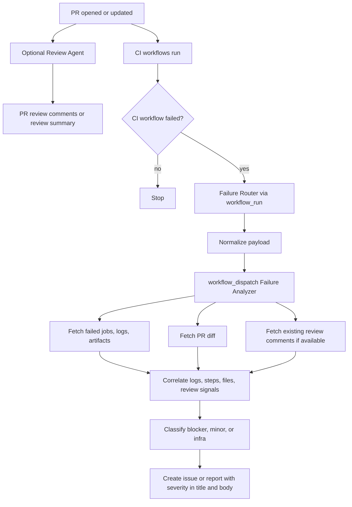
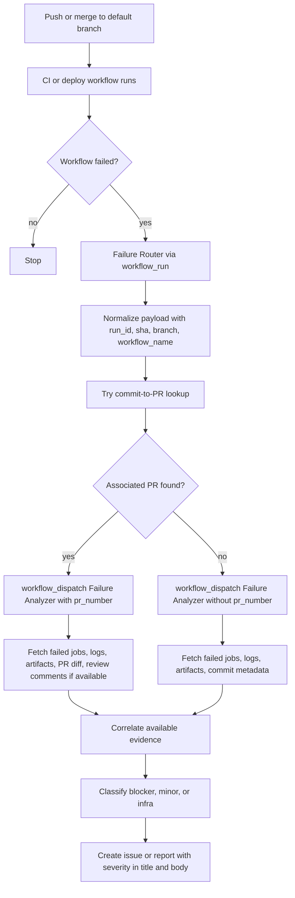

# Generic CI Failure Analysis Workflows

Reusable, repository-local automation for CI failure analysis.

This template can be installed in any GitHub repository in any organization. It does not require a
central runtime repository, Power Platform, or any PromoAgent-specific workflow. The repository that
uses the template owns its triggers, permissions, reports, billing, and audit trail.

Design rationale: [`docs/adr-001-generic-ci-failure-analysis.md`](docs/adr-001-generic-ci-failure-analysis.md).

## What It Does

The template keeps four roles separate:

- **Review Agent**: optional PR review agent. It reviews code only and never orchestrates CI failure handling.
- **CI Workflows**: existing build, test, lint, deploy, or release workflows. They stay deterministic and independent.
- **Failure Router**: small non-agentic workflow. It detects failed watched workflows, normalizes context, and dispatches the analyzer.
- **Failure Analyzer**: separate agentic workflow. It reads logs, artifacts, PR context, and optional review output, then creates a severity report.

The analyzer classifies failures as `blocker`, `minor`, or `infra`.

## Runtime Flows

### Normal PR Failure Flow



### Post-Merge / Main Failure Flow



## Generic Template Structure

Install these files into each target repository:

```text
.github/
  workflows/
    github-cr-agent.md                 # optional Review Agent
    <existing CI workflows>.yml         # CI Workflows, unchanged
    trigger-ci-failure-analysis.yml     # Failure Router
    ci-failure-analysis.md              # Failure Analyzer
```

If the target repository already has a review agent, do not copy `github-cr-agent.md`.
The analyzer treats review output as an optional input signal, not as an orchestrator.

## Repository-Specific Configuration Points

### Watched Workflows

Edit only the isolated configuration block in `trigger-ci-failure-analysis.yml`:

```yaml
on:
  workflow_run:
    # Repository configuration
    workflows:
      - CI
      - Build
      - Test
    types: [completed]
```

Use CI/test/build/deploy workflow names. Do not include the review-agent workflow unless you
explicitly want analyzer reports for review-agent failures.

GitHub requires `workflow_run.workflows` to be a static list in the workflow file, so this cannot
be loaded dynamically from a runtime config file. Keep repository-specific names in this block only.

### Review Agent Signals

If your repository uses a review agent, the analyzer can read its PR comments/reviews as evidence.
Repository-specific review bot names can be mentioned in the analyzer prompt in the target repo.
They should not be embedded in router logic.

## Stable Analyzer Contract

The Failure Router dispatches the Failure Analyzer with this stable `workflow_dispatch` input contract:

| Input | Required | Meaning |
|---|---:|---|
| `run_id` | Yes | Failed GitHub Actions workflow run ID |
| `run_url` | Yes | URL of the failed workflow run |
| `sha` | Yes | Commit SHA associated with the failed run |
| `workflow_name` | Yes | Name of the workflow that failed |
| `conclusion` | Yes | Workflow conclusion, usually `failure` |
| `branch` | Yes | Branch associated with the run |
| `pr_number` | No | PR number if known or discoverable |
| `owner` | Yes | Repository owner |
| `repo` | Yes | Repository name |
| `trigger_source` | No | Usually `workflow_run`; future values may include `repository_dispatch` |

`workflow_dispatch` is the default same-repository handoff mechanism. It gives typed inputs, a clear
manual re-run path, branch selection, and a simple audit trail. The analyzer must exist on the
default branch before it can be manually triggered from the GitHub Actions UI.

`repository_dispatch` is documented as a future extension for cross-repository or external triggers.
If added, it should map `client_payload` into the same analyzer contract before analysis starts.

## Permissions

Router:

```yaml
permissions:
  actions: write
  contents: read
  pull-requests: read
```

Analyzer:

```yaml
permissions:
  contents: read
  pull-requests: read
  issues: read
```

The analyzer writes only through its agentic workflow `safe-outputs`.

## Labels Are Optional

Recommended labels:

- `ci-analysis`
- `severity:blocker`
- `severity:minor`
- `severity:infra`

If labels are missing, the analyzer must still create the issue/report and include severity in
the title/body, for example `[CI-ANALYSIS][blocker] Build`.

## Bootstrap Install Steps

Bootstrap is one-time per repository:

1. Copy the router and analyzer into the target repository.
2. If the repository does not already have a review agent and you want one, copy `github-cr-agent.md`.
3. Configure `on.workflow_run.workflows` in `trigger-ci-failure-analysis.yml`.
4. Verify router and analyzer permissions.
5. Compile agentic workflows if your GitHub Agentic Workflows toolchain requires lock files.
6. Commit the Markdown specs, generated lock files if any, and router workflow to the default branch.
7. Optionally create labels.

If lock files are required, treat `gh aw compile` as a bootstrap/toolchain concern only. It is not
part of steady-state failure routing.

```text
.github/
  workflows/
    github-cr-agent.lock.yml
    ci-failure-analysis.lock.yml
```

## Steady-State Operation

Once installed on the default branch, steady state requires only normal repository activity:

- PR opens or updates.
- Optional Review Agent comments on the PR.
- CI/test/deploy workflow fails.
- Failure Router dispatches the analyzer using `workflow_dispatch`.
- Failure Analyzer creates a report even without PR context, review comments, artifacts, or labels.

### PR-Linked Failures

For PR-linked failures, the analyzer should:

- Read failed jobs, logs, and artifacts.
- Read PR files/diff.
- Read existing PR review comments when present.
- Correlate logs, failed steps, changed files, and review comments.

### Post-Merge Failures

For post-merge or push failures, the analyzer should:

- Read failed jobs, logs, and artifacts.
- Try to discover an associated PR from the commit SHA.
- Continue with logs and commit metadata when no PR is discoverable.
- Avoid assuming review output exists.

## Extending To New Workflows

To analyze another workflow, add its exact workflow name to the router's watched-workflow list.
No analyzer changes are needed if the workflow can be diagnosed from the stable contract and GitHub
run metadata.

To support external systems or cross-repository routing later, add a small adapter that uses
`repository_dispatch` or another trigger, then maps its payload into the same stable analyzer
contract. Do not make the analyzer parse multiple raw event shapes.

## Relationship To GithubHelper

GithubHelper can still diagnose failures interactively through Copilot Studio. The automatic path no longer needs
GithubHelper or Power Platform; it is fully native to GitHub Actions. GithubHelper can read the generated issues
later and ask the user whether to create or track a GitHub issue/action.
