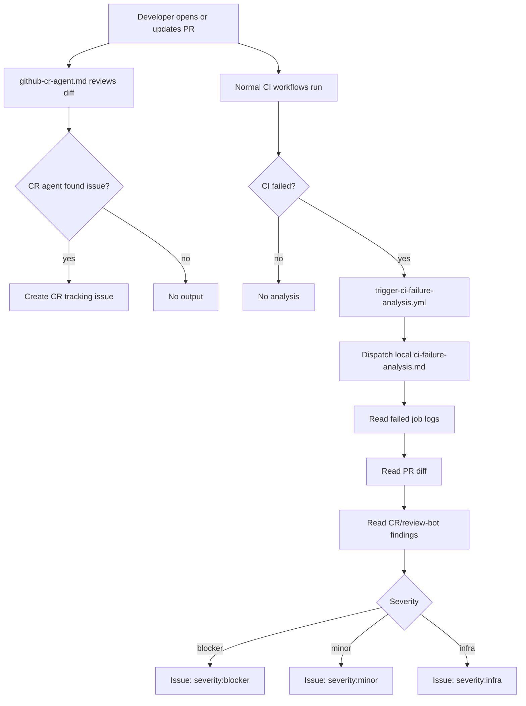

# Generic GitHub Agentic Workflows

Reusable, repository-local automation for code review and CI failure analysis.

This package is designed to be copied into **any GitHub repository in any organization**.
It does not depend on a central runtime repo, Power Platform, or `Amitro1234/vibe-coding-agents-workflow`.
That repo can host the source template, but each organization runs the workflows locally.

It uses [GitHub Agentic Workflows](https://github.blog/ai-and-ml/automate-repository-tasks-with-github-agentic-workflows/):
Markdown workflow specs are compiled into GitHub Actions lock files with `gh aw compile`.

## What It Does

- `github-cr-agent.md` reviews PR changes and creates a constrained tracking issue when it finds a real issue.
- `trigger-ci-failure-analysis.yml` listens for failed PR GitHub Actions runs using native `workflow_run`.
- `ci-failure-analysis.md` reads failed job logs, PR diff, and CR-agent/review-bot comments, then classifies severity:
  `blocker`, `minor`, or `infra`.
- CI analysis results are written as GitHub issues in the same repository.

## Flow



## Installed Files

Copy these files into each target repository:

```text
.github/
  workflows/
    github-cr-agent.md
    ci-failure-analysis.md
    trigger-ci-failure-analysis.yml
```

After compilation, commit the generated lock files too:

```text
.github/
  workflows/
    github-cr-agent.lock.yml
    ci-failure-analysis.lock.yml
```

## First-Time Setup In A Target Repo

1. Install the `gh-aw` CLI extension:

```bash
gh extension install github/gh-aw
```

2. Copy the workflow files into the target repo:

```bash
mkdir -p .github/workflows
cp path/to/templates/.github/workflows/github-cr-agent.md .github/workflows/
cp path/to/templates/.github/workflows/ci-failure-analysis.md .github/workflows/
cp path/to/templates/.github/workflows/trigger-ci-failure-analysis.yml .github/workflows/
```

3. Compile the agentic workflows:

```bash
gh aw compile
```

4. Commit the Markdown specs, generated lock files, and trigger workflow.

5. Create labels in the target repo:

| Label | Description |
|---|---|
| `code-review` | Issue created by the CR agent |
| `ci-analysis` | Issue created by the CI failure analysis agent |
| `severity:blocker` | Code bug — fix required before merge |
| `severity:minor` | Non-critical issue — track but do not block |
| `severity:infra` | Infrastructure/credentials issue — no code fix needed |

## Manual Test

After the workflows are pushed:

1. Open a test PR.
2. Push a commit that intentionally fails a low-risk CI check.
3. Confirm `Trigger CI Failure Analysis` runs after the failed workflow completes.
4. Confirm `ci-failure-analysis` creates a `ci-analysis` issue with a severity label.

## Relationship To GithubHelper

GithubHelper can still diagnose failures interactively through Copilot Studio. The automatic path no longer needs
GithubHelper or Power Platform; it is fully native to GitHub Actions. GithubHelper can read the generated issues
later and ask the user whether to create or track a GitHub issue/action.
