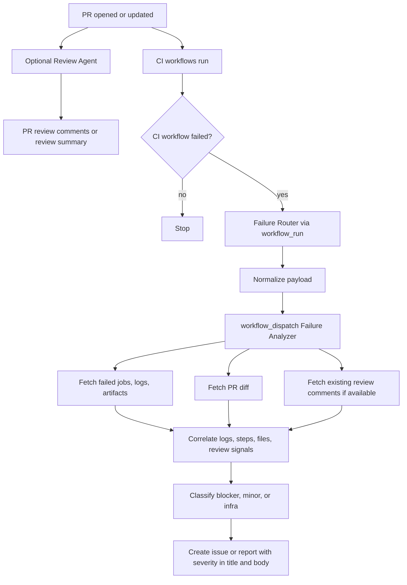
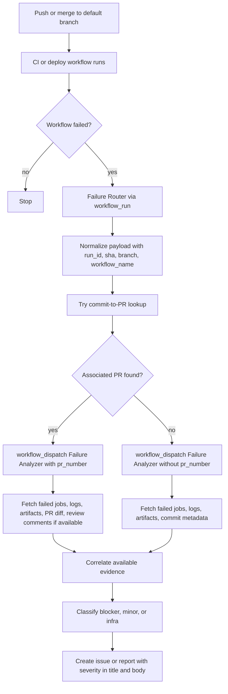

# ADR 001: Generic CI Failure Analysis Pattern

## Status

Accepted.

## Context

Repositories often already have a pull request review agent and several deterministic CI workflows.
CI failure analysis should use those signals without turning the review agent into an orchestrator.
The pattern must work across repositories and organizations, not just for one implementation.

## Decision

Use a four-role architecture:

1. **Review Agent**
   - Optional.
   - Reviews PR code only.
   - Produces PR comments/reviews that can later be read as evidence.
   - Must not trigger or orchestrate CI failure analysis.

2. **CI Workflows**
   - Existing build, test, lint, deploy, and release workflows.
   - Stay deterministic and independent.

3. **Failure Router**
   - A small non-agentic GitHub Actions workflow.
   - Uses native `workflow_run` as the default detector.
   - Watches a static list of repository-specific CI workflow names.
   - Runs only when `conclusion == failure`.
   - Normalizes the raw GitHub event into a stable analyzer contract.
   - Hands off to the analyzer with `workflow_dispatch`.

4. **Failure Analyzer**
   - A separate agentic workflow.
   - Accepts a stable payload, independent of the raw `workflow_run` event shape.
   - Fetches failed jobs, logs, and artifacts.
   - Detects whether the failure is linked to a PR.
   - If PR-linked, fetches PR diff and existing review-agent comments.
   - Continues with logs-only analysis when there is no PR or no review output.
   - Creates an issue/report even when labels are missing.

## Runtime Flows

### Normal PR Failure Flow



### Post-Merge / Main Failure Flow



## Stable Analyzer Contract

The router dispatches the analyzer with these inputs:

- `run_id`
- `run_url`
- `sha`
- `workflow_name`
- `conclusion`
- `branch`
- `pr_number`
- `owner`
- `repo`
- `trigger_source`

`workflow_dispatch` is the default same-repository handoff because it provides typed inputs,
manual re-run support, branch selection, and a simple audit trail. The analyzer must exist on the
default branch before it can be manually triggered from the GitHub Actions UI.

`repository_dispatch` is reserved for future cross-repository or external triggers. If introduced,
it should map its `client_payload` into the same stable analyzer contract before analysis starts.

## Repository-Specific Configuration

The only required repository-specific router setting is the static watched-workflow list:

```yaml
on:
  workflow_run:
    workflows:
      - CI
      - Build
      - Test
    types: [completed]
```

GitHub requires this list to be static in the workflow file. It cannot be loaded from a runtime
config file. Keep this as an isolated configuration block and do not embed repository-specific
workflow names elsewhere in router logic.

## Bootstrap vs Steady State

Bootstrap is one-time per repository:

- Install the router and analyzer on the default branch.
- Configure the watched-workflow list.
- Compile agentic workflow lock files if the GitHub Agentic Workflows toolchain requires them.
- Verify permissions.
- Optionally create labels.

Steady state:

- A normal PR or push runs existing CI workflows.
- Review agent output may exist, but is only an input signal.
- CI failure triggers the router.
- Router dispatches the analyzer with the stable contract.
- Analyzer reports severity even without PR context, review comments, artifacts, or labels.

## Labels

Labels are optional. Recommended labels are:

- `ci-analysis`
- `severity:blocker`
- `severity:minor`
- `severity:infra`

Missing labels must not block issue/report creation. Severity must always be present in the
issue/report title and body.

## Extension Guidance

To add a new workflow to analysis, add its exact workflow name to the router's watched list.

To support a new trigger source, such as a webhook bridge or external orchestrator, add a small
adapter that dispatches the analyzer with the same stable contract. Do not change analyzer behavior
based on raw event shapes.

To customize review-agent discovery, update analyzer instructions in the target repository to
recognize that repository's review bot names. Keep those names out of the generic router.
